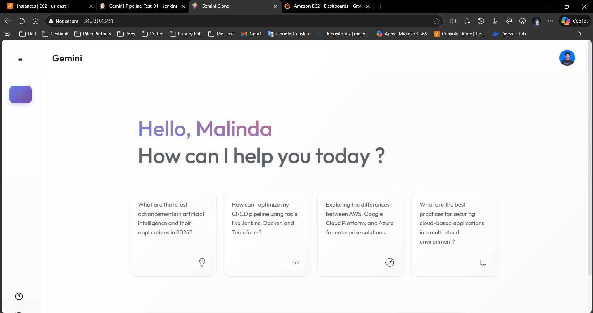
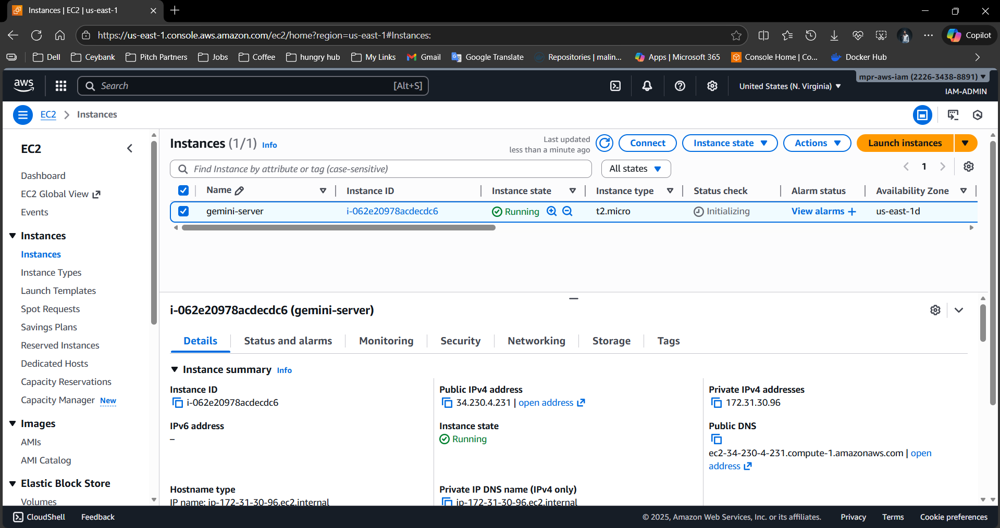
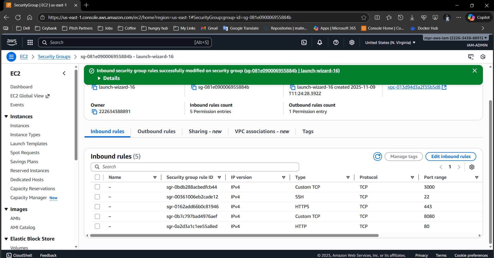
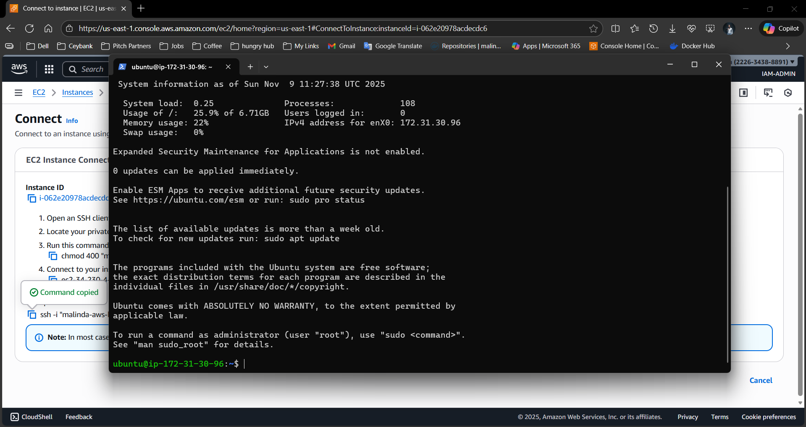
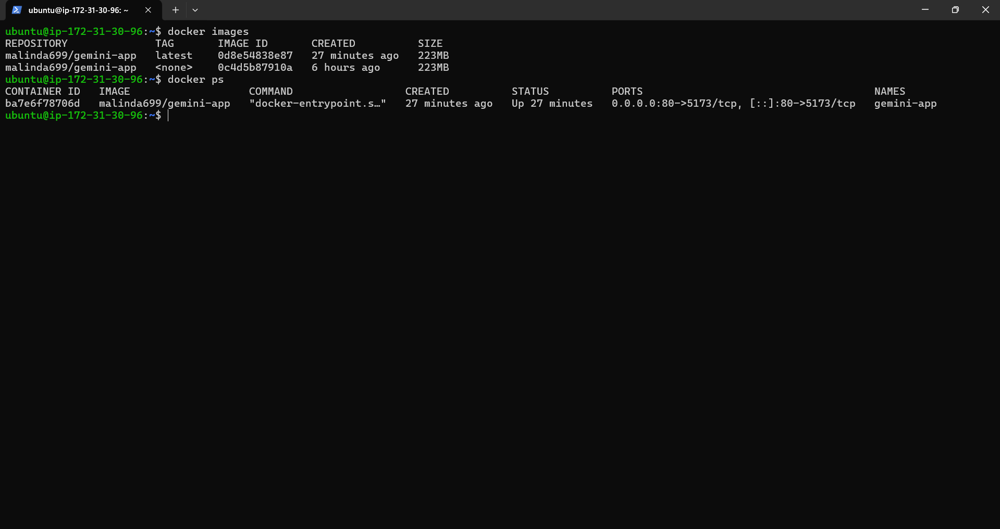
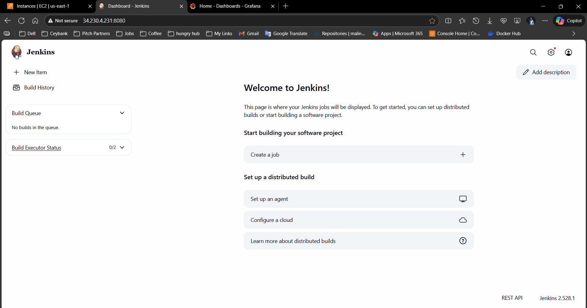
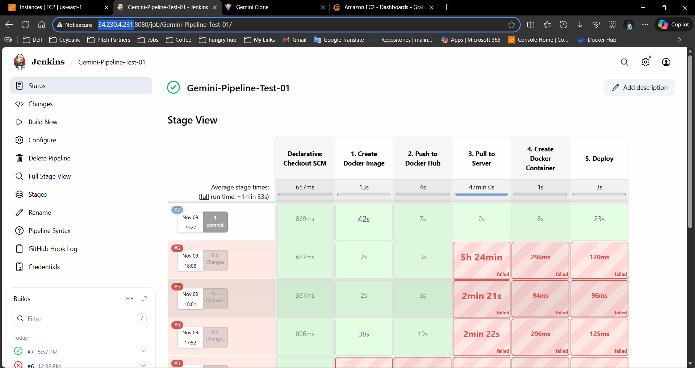
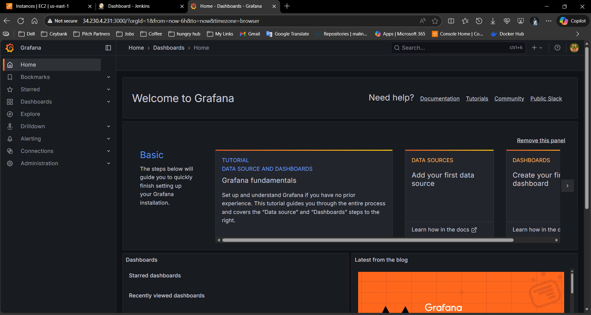
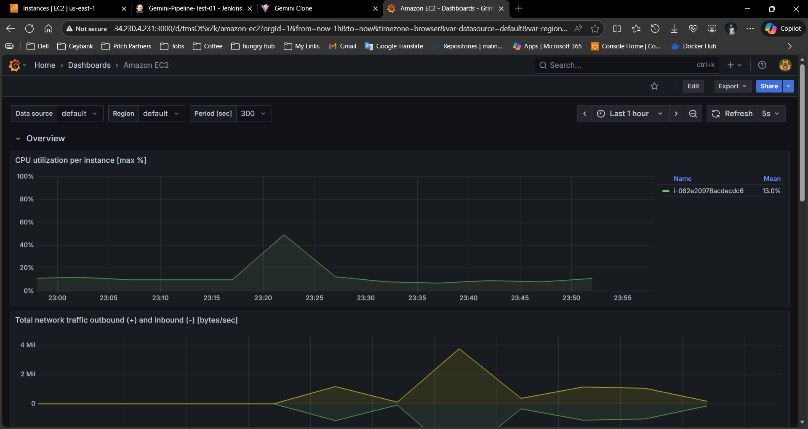
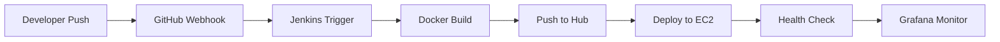

# 🤖 Google Gemini AI Clone - Full Stack DevOps Project

A comprehensive React-based Gemini AI clone with complete CI/CD pipeline, containerization, and monitoring setup. This project demonstrates modern web development practices with automated deployment to AWS EC2 using Jenkins, Docker, and Grafana monitoring.



## 🚀 Project Overview

This project is a full-featured Google Gemini AI clone that showcases:

- **Modern React Frontend** with responsive design
- **Google AI Studio API Integration** for chat functionality
- **Complete CI/CD Pipeline** using Jenkins
- **Containerization** with Docker
- **Cloud Deployment** on AWS EC2
- **Real-time Monitoring** with Grafana
- **Infrastructure as Code** approach

## �️ Tech Stack

### Frontend

- **React.js 18.3.1** - Modern UI framework
- **Vite 6.0.11** - Fast build tool
- **CSS3** - Custom styling with gradients and animations

### Backend & API

- **Google AI Studio API** - Gemini 2.0 Flash model
- **Node.js** - Runtime environment

### DevOps & Infrastructure

- **Docker** - Containerization
- **Jenkins** - CI/CD automation
- **AWS EC2** - Cloud hosting
- **Grafana** - Monitoring and analytics
- **Git & GitHub** - Version control with webhooks

## 📋 Table of Contents

1. [React Application](#-react-application)
2. [AWS EC2 Setup](#-aws-ec2-setup)
3. [SSH Connection](#-ssh-connection-setup)
4. [Docker Installation](#-docker-installation)
5. [Jenkins Setup](#-jenkins-setup)
6. [Grafana Installation](#-grafana-installation)
7. [CI/CD Pipeline](#-cicd-pipeline)
8. [Local Development](#-local-development)

---

## 🎯 React Application

The main application is a modern, responsive React-based chat interface that mimics Google Gemini's functionality.

### Key Features:

- **Real-time AI Chat** - Interactive conversations with Gemini AI
- **Modern UI/UX** - Clean, responsive design with smooth animations
- **Mobile Responsive** - Optimized for all device sizes
- **Fast Performance** - Built with Vite for optimal loading speeds


### Quick Start:

```bash
npm install
npm run dev
```

---

## ☁️ AWS EC2 Setup

### Step 1: Create EC2 Instance



**Instance Configuration:**

- **AMI:** Ubuntu Server 22.04 LTS
- **Instance Type:** t2.micro (Free tier eligible)
- **Key Pair:** Create new key pair for SSH access
- **Storage:** 8GB gp2 (Free tier)

### Step 2: Configure Security Groups



**Required Inbound Rules:**

```
Type: SSH          | Port: 22   | Source: 0.0.0.0/0
Type: HTTP         | Port: 80   | Source: 0.0.0.0/0
Type: Custom TCP   | Port: 8080 | Source: 0.0.0.0/0 (Jenkins)
Type: Custom TCP   | Port: 3000 | Source: 0.0.0.0/0 (Grafana)
```

---

## 🔐 SSH Connection Setup

### Connect to EC2 Instance



**Windows Command:**

```cmd
ssh -i "your-key.pem" ubuntu@your-ec2-public-ip
```

**Linux/Mac Command:**

```bash
chmod 400 your-key.pem
ssh -i "your-key.pem" ubuntu@your-ec2-public-ip
```

**Verify Connection:**

```bash
whoami
pwd
sudo apt update
```

---

## 🐳 Docker Installation

### Install Docker on EC2


**Installation Commands:**

```bash
# Update packages
sudo apt update

# Install Docker
sudo apt install docker.io -y

# Start Docker service
sudo systemctl start docker
sudo systemctl enable docker

# Add user to docker group
sudo usermod -aG docker ubuntu

# Verify installation
docker --version
docker run hello-world
```

### Docker Images & Containers



**Key Docker Commands:**

```bash
# Build image
docker build -t gemini-app .

# Run container
docker run -d -p 80:5173 --name gemini-app gemini-app

# View running containers
docker ps

# View all images
docker images
```

---

## 🔧 Jenkins Setup

### Install Jenkins


**Installation Process:**

```bash
# Install Java
sudo apt install openjdk-11-jdk -y

# Add Jenkins repository
wget -q -O - https://pkg.jenkins.io/debian/jenkins.io.key | sudo apt-key add -
sudo sh -c 'echo deb http://pkg.jenkins.io/debian-stable binary/ > /etc/apt/sources.list.d/jenkins.list'

# Install Jenkins
sudo apt update
sudo apt install jenkins -y

# Start Jenkins
sudo systemctl start jenkins
sudo systemctl enable jenkins

# Get initial password
sudo cat /var/lib/jenkins/secrets/initialAdminPassword
```

### Jenkins Configuration



### Install Required Plugins


**Essential Plugins:**

- Git Plugin
- Docker Plugin
- SSH Agent Plugin
- Pipeline Plugin
- GitHub Integration Plugin

### Configure Credentials


**Required Credentials:**

1. **Docker Hub Credentials** (`docker-hub-creds`)

   - Type: Username with password
   - Username: Your Docker Hub username
   - Password: Your Docker Hub password

2. **SSH Private Key** (`gemini-id`)
   - Type: SSH Username with private key
   - Username: ubuntu
   - Private Key: Your EC2 .pem file content

### Jenkins Pipeline



**Pipeline Stages:**

1. **Build Docker Image** - Create application container
2. **Push to Docker Hub** - Upload to registry
3. **Pull to Server** - Download on EC2
4. **Create Container** - Deploy application
5. **Verify Deployment** - Health check

---

## 📊 Grafana Installation

### Install Grafana


**Installation Commands:**

```bash
# Add Grafana repository
sudo apt-get install -y adduser libfontconfig1
wget https://dl.grafana.com/enterprise/release/grafana-enterprise_9.0.0_amd64.deb
sudo dpkg -i grafana-enterprise_9.0.0_amd64.deb

# Start Grafana
sudo systemctl start grafana-server
sudo systemctl enable grafana-server

# Verify installation
sudo systemctl status grafana-server
```

### Grafana Homepage



**Access Grafana:**

- URL: `http://your-ec2-ip:3000`
- Default Login: admin/admin
- Change password on first login

### Grafana Dashboards




**Dashboard Features:**

- **System Metrics** - CPU, Memory, Disk usage
- **Docker Metrics** - Container performance
- **Application Metrics** - Response times, error rates
- **Network Metrics** - Bandwidth, connections
- **Custom Alerts** - Automated notifications

---

## 🔄 CI/CD Pipeline

### Pipeline Architecture



### Jenkinsfile Configuration

```groovy
pipeline {
    agent any
    environment {
        DOCKER_IMAGE = 'malinda699/gemini-app'
        EC2_HOST = '34.230.4.231'
    }
    stages {
        stage('1. Create Docker Image') {
            steps {
                sh 'docker build -t ${DOCKER_IMAGE} .'
            }
        }
        stage('2. Push to Docker Hub') {
            steps {
                withCredentials([usernamePassword(credentialsId: 'docker-hub-creds',
                                usernameVariable: 'DOCKER_USER',
                                passwordVariable: 'DOCKER_PASS')]) {
                    sh 'echo $DOCKER_PASS | docker login -u $DOCKER_USER --password-stdin'
                    sh 'docker push ${DOCKER_IMAGE}'
                }
            }
        }
        stage('3. Pull to Server') {
            steps {
                sshagent(['gemini-id']) {
                    sh "ssh -o StrictHostKeyChecking=no ubuntu@${EC2_HOST} 'docker pull ${DOCKER_IMAGE}'"
                }
            }
        }
        stage('4. Create Docker Container') {
            steps {
                sshagent(['gemini-id']) {
                    sh """
                        ssh -o StrictHostKeyChecking=no ubuntu@${EC2_HOST} '
                            docker stop gemini-app || true
                            docker rm gemini-app || true
                            docker run -d --name gemini-app -p 80:5173 ${DOCKER_IMAGE}
                        '
                    """
                }
            }
        }
        stage('5. Deploy') {
            steps {
                sshagent(['gemini-id']) {
                    sh "ssh -o StrictHostKeyChecking=no ubuntu@${EC2_HOST} 'docker ps | grep gemini-app'"
                }
                echo 'App deployed at http://${EC2_HOST}'
            }
        }
    }
}
```

---

## 💻 Local Development

### Prerequisites

- Node.js 18+ installed
- Git installed
- Google AI Studio API key

### Installation

```bash
# Clone repository
git clone https://github.com/malinda6997/Google-Gemini-Clone-Project.git
cd Google-Gemini-Clone-Project

# Install dependencies
npm install

# Create .env file
echo "VITE_GEMINI_API_KEY=your_api_key_here" > .env

# Start development server
npm run dev
```

### Available Scripts

```bash
npm run dev          # Start development server
npm run build        # Build for production
npm run preview      # Preview production build
npm run lint         # Run ESLint
```

---

## 🌐 Live Demo

### Production URLs

- **Main Application:** `http://34.230.4.231`
- **Jenkins Dashboard:** `http://34.230.4.231:8080`
- **Grafana Monitoring:** `http://34.230.4.231:3000`

### GitHub Repository

� **Repository:** [Google-Gemini-Clone-Project](https://github.com/malinda6997/Google-Gemini-Clone-Project)

---

## 📈 Monitoring & Analytics

### Key Metrics Tracked

- **Application Performance:** Response times, throughput
- **Infrastructure Health:** CPU, memory, disk usage
- **Container Metrics:** Docker container performance
- **User Analytics:** Page views, session duration
- **Error Tracking:** Application errors and logs

### Alerting Setup

- **High CPU Usage:** > 80% for 5 minutes
- **Memory Usage:** > 90% for 3 minutes
- **Application Downtime:** Service unavailable
- **Failed Deployments:** Pipeline failures

---

## 🚀 Future Enhancements

- [ ] **Kubernetes Deployment** - Container orchestration
- [ ] **SSL/TLS Certificates** - HTTPS security
- [ ] **Load Balancer** - High availability setup
- [ ] **Database Integration** - Chat history persistence
- [ ] **User Authentication** - Login/signup functionality
- [ ] **Multi-environment Setup** - Dev/Staging/Prod
- [ ] **Automated Testing** - Unit and integration tests
- [ ] **Blue-Green Deployment** - Zero-downtime deployments

---

## 🤝 Contributing

1. **Fork** the repository
2. **Create** a feature branch (`git checkout -b feature/AmazingFeature`)
3. **Commit** your changes (`git commit -m 'Add some AmazingFeature'`)
4. **Push** to the branch (`git push origin feature/AmazingFeature`)
5. **Open** a Pull Request

---

## � License

This project is licensed under the **MIT License** - see the [LICENSE](LICENSE) file for details.

---

## 👨‍💻 Author

**Malinda Prabath**

- **GitHub:** [@malinda6997](https://github.com/malinda6997)
- **Project Link:** [Google-Gemini-Clone-Project](https://github.com/malinda6997/Google-Gemini-Clone-Project)

---

## 🙏 Acknowledgments

- **Google AI Studio** for providing the Gemini API
- **React Team** for the amazing framework
- **Docker** for containerization technology
- **Jenkins** for CI/CD automation
- **AWS** for cloud infrastructure
- **Grafana** for monitoring solutions

---

<div align="center">

### ⭐ Star this repository if you found it helpful!

**Made with ❤️ and lots of ☕**

</div>
